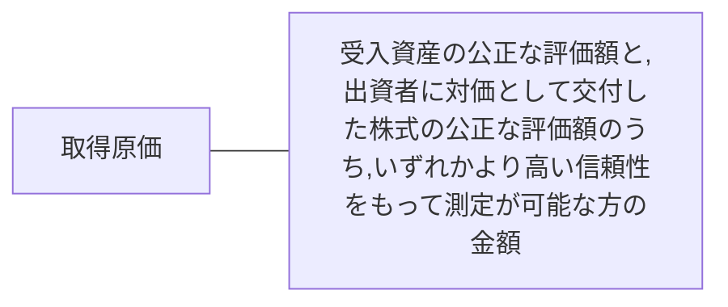

取得方法別のの取得原価

(1)購入の場合

```mermaid
flowchart LR

取得原価 --- 購入代価+付随費用

```

(2)自家建設の場合

```mermaid
flowchart LR

取得原価 --- 適正な原価計算の基準に準拠して算定された製造原価

```

(3)現物出資の場合

```mermaid
flowchart LR

取得原価 --- 受入資産の公正な評価額と,出資者に対価として交付した株式の公正な評価額のうち,いずれかより高い信頼性をもって測定が可能な方の金額

```

(4)交換の場合

```mermaid
flowchart LR

取得原価 --- 譲渡資産の簿価

```
ただし,法人税法では、圧縮記帳が認められている.

(5)贈与の場合

```mermaid
flowchart LR

取得原価 --- 時価などの公正な評価額

```
ただし、国庫補助金や工事負担金で取得した固定資産については,取得に要した支出額と補助金の額を相殺する圧縮記帳の採用が認められている.