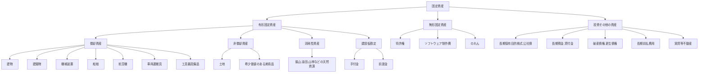

固定資産の区分表示

```mermaid
graph TD

固定資産 --> 有形固定資産 --> 償却資産
固定資産 --> 無形固定資産
固定資産 --> 投資その他の資産
有形固定資産 --> 非償却資産
有形固定資産 --> 消耗性資産
有形固定資産 --> 建設仮勘定
償却資産 --> 建物 & 建築物 & 機械装置 & 船舶 & 航空機 & 車両運搬具 & 工具器具備品
非償却資産 --> 土地 & 希少価値のある美術品
建設仮勘定 --> 手付金 & 前渡金
無形固定資産 --> 特許権 & ソフトウェア制作費 & のれん
投資その他の資産 --> 長期保有目的株式,公社債 & 長期預金,貸付金 & 破産債権,更生債権 & 長期前払費用 & 賃貸等不動産
消耗性資産 --> 鉱山,油田,山林などの天然資源

```