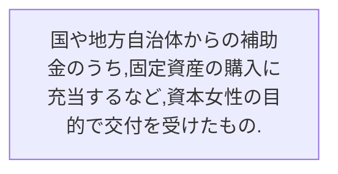
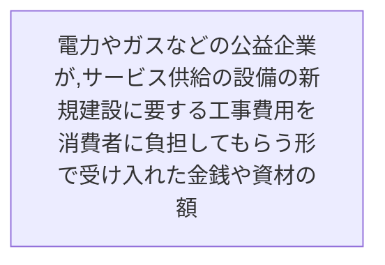
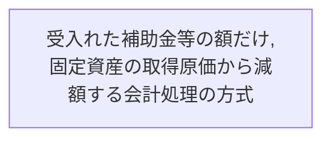
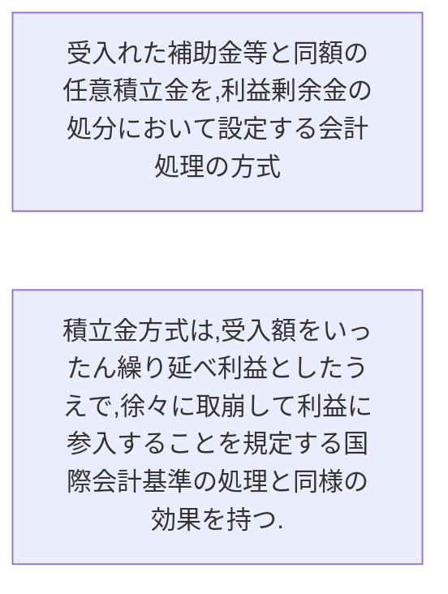

国庫補助金等で取得した資産

国庫補助金(建設補助金)

```mermaid

flowchart LR

国や地方自治体からの補助金のうち,固定資産の購入に充当するなど,資本女性の目的で交付を受けたもの.

```

工事負担金

```mermaid

flowchart LR

電力やガスなどの公益企業が,サービス供給の設備の新規建設に要する工事費用を消費者に負担してもらう形で受け入れた金銭や資材の額

```

圧縮記帳方式

```mermaid

flowchart LR

受入れた補助金等の額だけ,固定資産の取得原価から減額する会計処理の方式

```

積立金方式

```mermaid

flowchart LR

受入れた補助金等と同額の任意積立金を,利益剰余金の処分において設定する会計処理の方式;
積立金方式は,受入額をいったん繰り延べ利益としたうえで,徐々に取崩して利益に参入することを規定する国際会計基準の処理と同様の効果を持つ.

```
