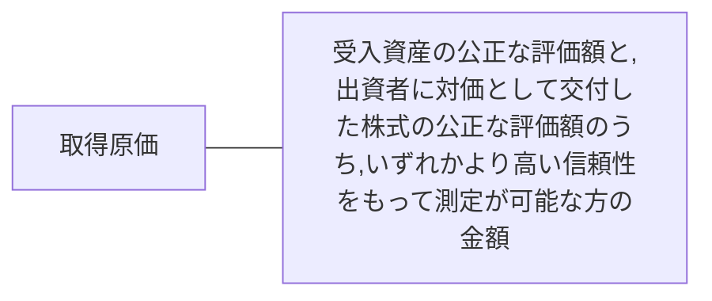

有形固定資産の取得原価

(1)購入の場合

```mermaid
flowchart LR

取得原価 --- 購入代価+付随費用

```

(2)自家建設の場合

```mermaid
flowchart LR

取得原価 --- 適正な原価計算の基準に準拠して算定された製造原価

```

(3)現物出資の場合

```mermaid
flowchart LR

取得原価 --- 受入資産の公正な評価額と,出資者に対価として交付した株式の公正な評価額のうち,いずれかより高い信頼性をもって測定が可能な方の金額

```

(4)交換の場合

```mermaid
flowchart LR

取得原価 --- 購入代価+付随費用

```