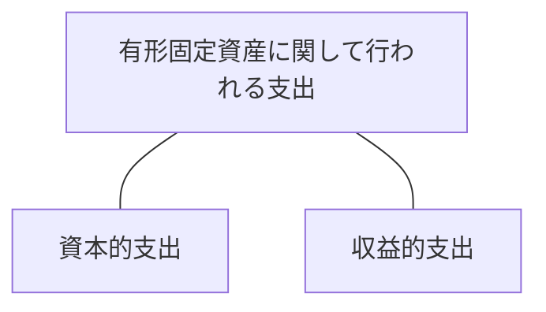
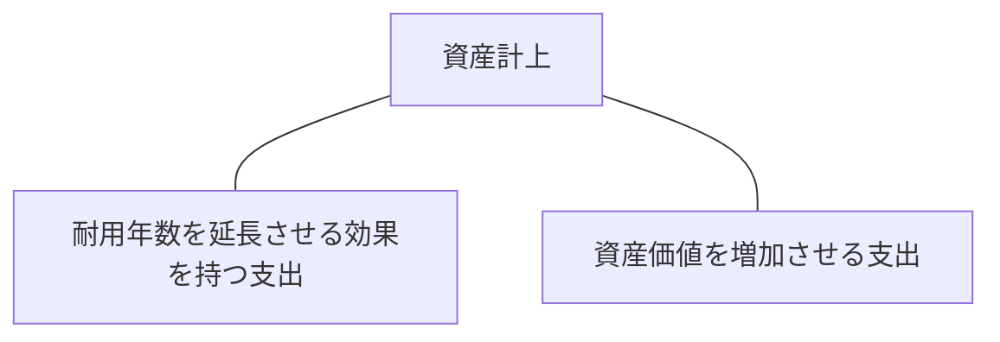
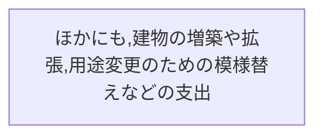
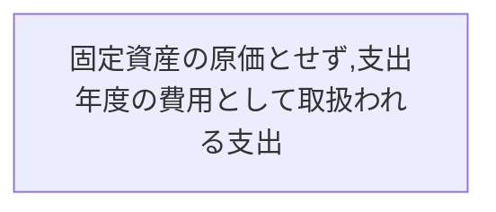
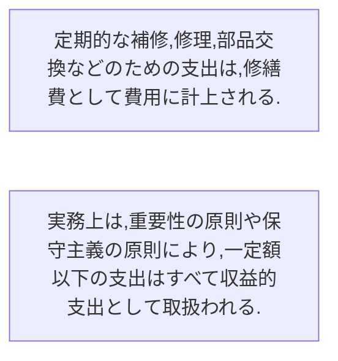

有形固定資産に関して行われる支出

```mermaid
flowchart TD

有形固定資産に関して行われる支出 --- 資本的支出 & 収益的支出

```

資本的支出

```mermaid
flowchart LR

当該固定資産の原価に算入されて資産となる支出

```

資本的支出として資産計上されるもの

```mermaid
flowchart TD

資産計上 --- 耐用年数を延長させる効果を持つ支出 & 資産価値を増加させる支出

```

```mermaid
flowchart TD

ほかにも,建物の増築や拡張,用途変更のための模様替えなどの支出

```

収益的支出

```mermaid
flowchart LR

固定資産の原価とせず,支出年度の費用として取扱われる支出

```

収益的支出として修繕費に計上されるもの

```mermaid
flowchart LR

定期的な補修,修理,部品交換などのための支出は,修繕費として費用に計上される.
実務上は,重要性の原則や保守主義の原則により,一定額以下の支出はすべて収益的支出として取扱われる.

```