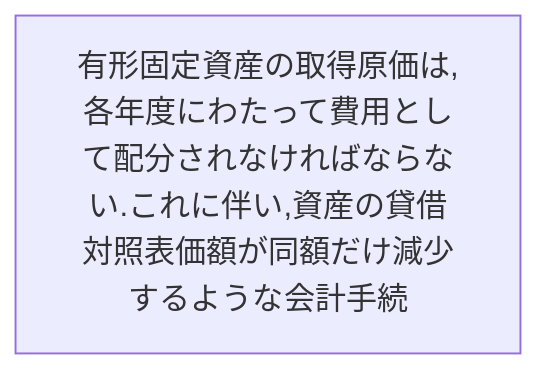

耐用年数

```mermaid
flowchart TD

資産の使用可能期間

```

残存価額

```mermaid
flowchart TD

耐用年数が経過した時点での,資産の評価額

```

減価償却

```mermaid
flowchart TD

有形固定資産の取得原価は,各年度にわたって費用として配分されなければならない.これに伴い,資産の貸借対照表価額が同額だけ減少するような会計手続

```

自己金融作用

```mermaid
flowchart TD

減価償却により,企業内に対応する額の資金増加が起こる現象.

```