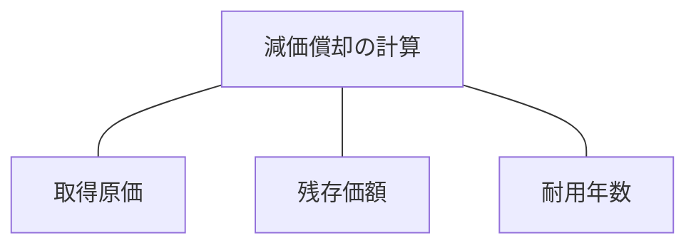
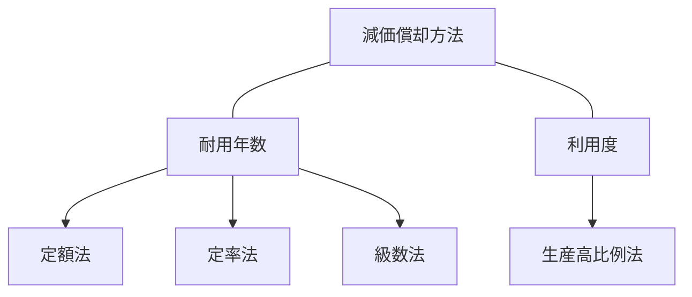
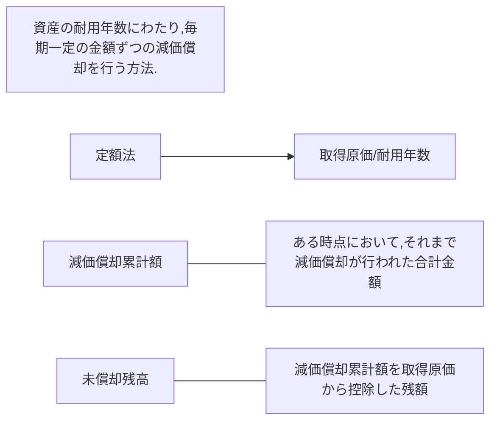
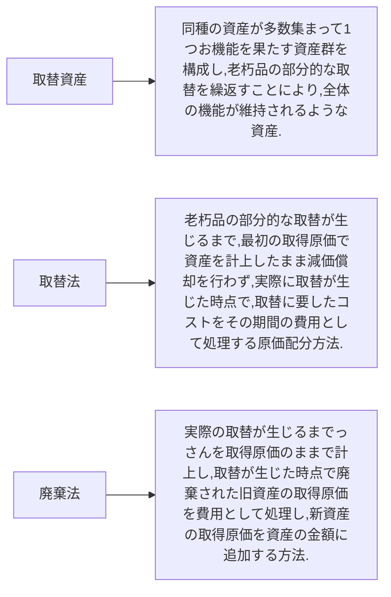
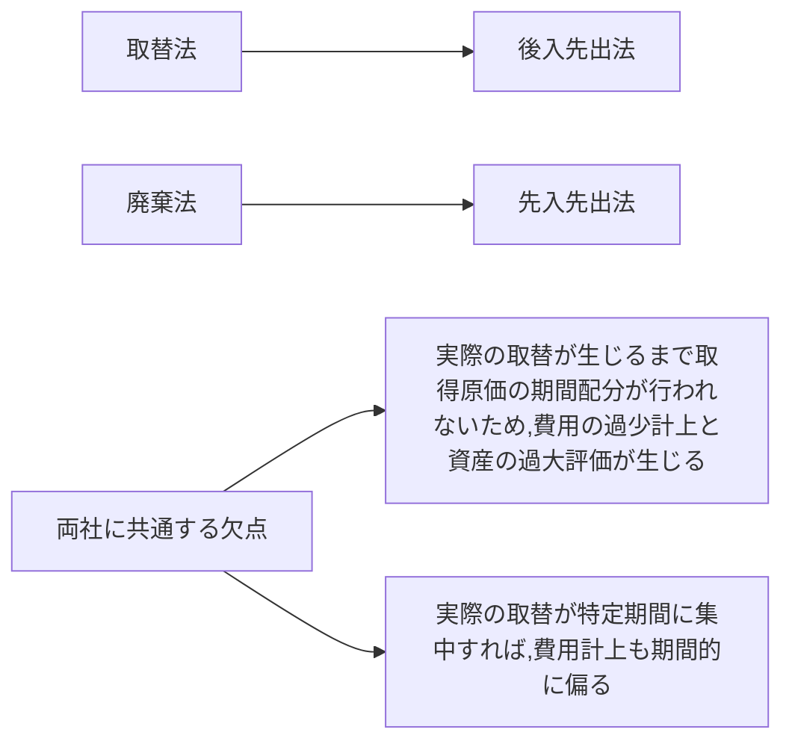

減価償却の計算要素


減価償却の計算方法



定額法


定率法
```mermaid
flowchart LR

A[取得原価 - 減価償却累計額 * 償却率];

期首の未償却残高に毎期一定の償却率を乗じて,各期の減価償却費を算定する方法.

200％定率法の場合は,所定倍率=2とする.

```
定率法の計算方式
```mermaid
flowchart LR

期首未償却残高*償却率>期首未償却残高/耐用年数 --> 前者の金額が減価償却費

期首未償却残高*償却率<期首未償却残高/耐用年数 --> 後者の金額が減価償却費

加速償却法 --- 初期の年度ほど大きな減価償却費が計上されて、未償却残高が急速に減少する減価償却の方法

```

級数法
```mermaid
flowchart LR

耐用年数に基づいて計算した算術級数を利用する減価償却方法.

残存価額:ゼロ,耐用年数:n年,のときの有形固定資産のk年目の減価償却費

減価償却費 --> 取得原価 * ( (n-k+1) / (n(n + 1)/2) )

```

生産高比例法
```mermaid
flowchart LR

資産の利用度に応じて原価配分を行う減価償却法.

減価償却費 --> 取得原価 * (各期の実際利用量 / 総利用可能量)

```

取替法


取替法と廃棄法
