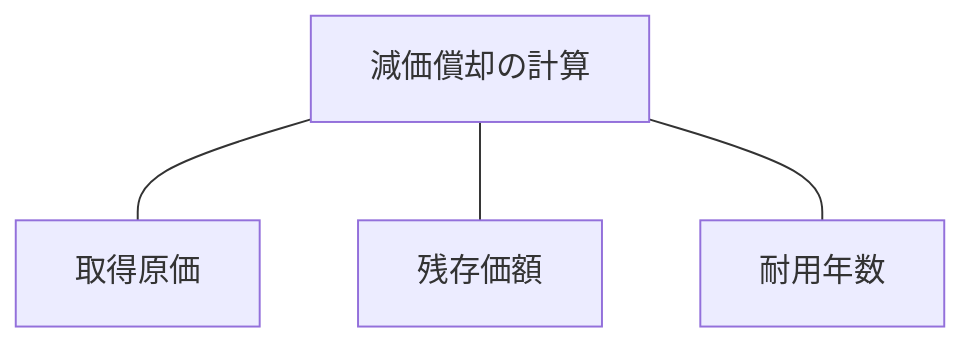
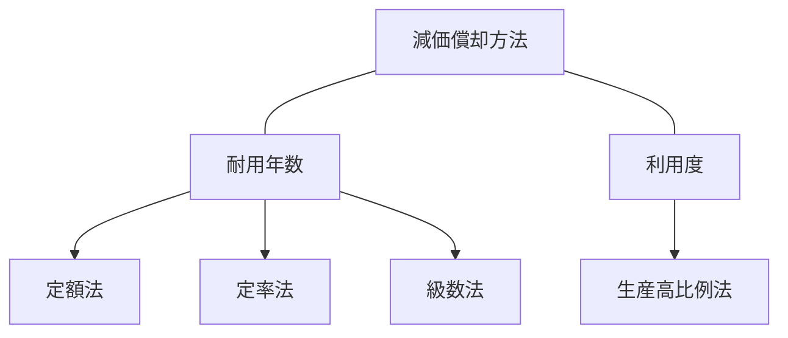

減価償却の計算要素

```mermaid
flowchart TD

減価償却の計算 --- 取得原価 & 残存価額 & 耐用年数

```

減価償却の計算方法

```mermaid
flowchart TD

減価償却方法 --- 耐用年数 --> 定額法 & 定率法 & 級数法
減価償却方法 --- 利用度 --> 生産高比例法

```

定額法
```mermaid
flowchart LR

資産の耐用年数にわたり,毎期一定の金額ずつの減価償却を行う方法.

定額法 -> 取得原価/耐用年数

減価償却累計額 --- ある時点において,それまで減価償却が行われた合計金額

未償却残高 --- 減価償却累計額を取得原価から控除した残額

```

